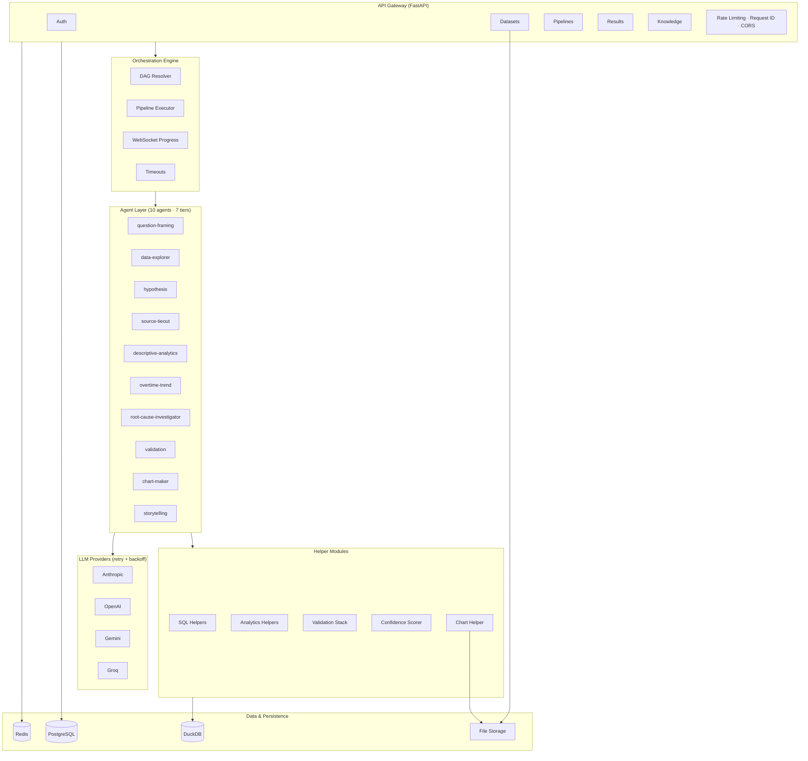

# The Analyst Backend

A production-ready backend that accepts CSV/Excel uploads, runs a 10-agent analytical pipeline powered by LLMs, and returns validated findings with confidence scoring. The system learns from corrections and accumulated knowledge to improve future analyses.

## Features

- **Multi-agent DAG pipeline** — 10 specialized agents execute in 7 tiers with parallel execution, timeouts, and progress streaming
- **Agent Gate** — Intelligent agent selection that skips irrelevant agents based on question classification and dataset characteristics, reducing latency and cost
- **4 LLM providers** — Anthropic, OpenAI, Google Gemini, Groq with automatic retry and exponential backoff
- **Smart model routing** — Users choose a specific model or use "auto" mode where the system picks the best model per agent task (premium/standard/fast tiers)
- **Intelligent plan selection** — Automatically selects optimal execution plans based on question type and data shape
- **DuckDB analytics** — Per-dataset analytical engine with safe SQL execution, validation, and pre-built analytical functions
- **4-layer validation** — Structural, logical, business rules, and Simpson's Paradox checks with A-F confidence grading
- **Chart generation** — Matplotlib/Seaborn charts following Storytelling with Data methodology, exportable as PNG/SVG/PDF
- **Knowledge system** — Corrections and learnings persist across sessions, injected into agent prompts
- **Export** — HTML, PDF (WeasyPrint), and Word (python-docx) report generation
- **Security** — JWT auth, WebSocket ownership verification, rate limiting, structured JSON logging
- **Caching** — Redis-backed response caching with user-scoped keys for results, datasets, and LLM responses
- **Docker-ready** — Multi-stage Dockerfile, docker-compose with Postgres + Redis, automatic migrations and seeding

## Quick Start

### With Docker (recommended)

```bash
# Clone the repository
git clone https://github.com/Creacubedusa/the-analyst-backend.git
cd the-analyst-backend

# Copy environment file and configure
cp .env.example .env
# Edit .env — set SECRET_KEY, POSTGRES_PASSWORD, and at least one LLM API key

# Start all services (builds image, runs migrations, seeds admin user)
make up

# Or without Make:
# docker compose up --build -d

# API available at http://localhost:8000
# Swagger docs at http://localhost:8000/api/v1/docs
# ReDoc at http://localhost:8000/api/v1/redoc
```

### Without Docker

```bash
# Prerequisites: Python 3.11+, PostgreSQL 16+, Redis, uv

# Full setup (creates venv, installs deps, copies .env.example)
make setup

# Or manually:
# python -m venv .venv
# source .venv/bin/activate
# uv pip install -e ".[dev]"
# cp .env.example .env

# Edit .env with your SECRET_KEY, DATABASE_URL, REDIS_URL, and LLM API keys

# Run database migrations
make migrate

# Seed the admin user
make seed

# Start the development server (hot reload)
make dev
```

### First Login

After setup, login with the admin credentials from your `.env`:

```bash
curl -X POST http://localhost:8000/api/v1/auth/login \
  -H "Content-Type: application/json" \
  -d '{"email": "admin@example.com", "password": "YOUR_ADMIN_PASSWORD"}'
```

## Architecture



## LLM Providers

Set `LLM_DEFAULT_PROVIDER` in `.env`. At least one API key is required.

| Provider | Env Var | Default Model | Tier |
| ---------- | --------- | --------------- | ------ |
| Anthropic | `ANTHROPIC_API_KEY` | claude-sonnet-4-20250514 | Premium |
| OpenAI | `OPENAI_API_KEY` | gpt-4o | Premium |
| Google Gemini | `GEMINI_API_KEY` | gemini-2.5-pro | Standard |
| Groq | `GROQ_API_KEY` | llama-3.3-70b-versatile | Fast |

All providers include automatic retry with exponential backoff on rate limits (429) and server errors (5xx).

### Model Selection

When creating a pipeline, users can choose which model to use via the `model` field:

- **`"auto"`** (default) — System picks the best model per agent based on task complexity:
  - Premium tier (complex reasoning): Claude Sonnet 4 or GPT-4o
  - Standard tier (balanced): Gemini 2.5 Pro or GPT-4o
  - Fast tier (simple extraction): Groq Llama or Claude Haiku
- **Provider name** (e.g. `"anthropic"`) — Uses that provider's default model for all agents
- **Model ID** (e.g. `"gpt-4o-mini"`) — Uses that exact model for all agents

Use `GET /api/v1/models` to get the list of available models for a frontend dropdown.

## API Endpoints

| Method | Endpoint | Description |
| -------- | ---------- | ------------- |
| `POST` | `/api/v1/auth/register` | Register a new user |
| `POST` | `/api/v1/auth/login` | Login and get tokens |
| `POST` | `/api/v1/auth/refresh` | Refresh access token |
| `GET` | `/api/v1/auth/me` | Get current user profile |
| `POST` | `/api/v1/datasets` | Upload CSV/Excel files |
| `GET` | `/api/v1/datasets` | List datasets |
| `GET` | `/api/v1/datasets/:id` | Dataset detail + schema |
| `GET` | `/api/v1/datasets/:id/tables/:name/preview` | Preview table data |
| `DELETE` | `/api/v1/datasets/:id` | Delete dataset |
| `GET` | `/api/v1/models` | List available LLM models (for dropdown) |
| `POST` | `/api/v1/pipelines` | Start analysis pipeline |
| `GET` | `/api/v1/pipelines` | List pipelines |
| `GET` | `/api/v1/pipelines/:id` | Pipeline status + agents |
| `POST` | `/api/v1/pipelines/:id/cancel` | Cancel running pipeline |
| `WS` | `/api/v1/pipelines/:id/ws` | Real-time progress events |
| `GET` | `/api/v1/results/:id` | Full results (findings, charts, narrative) |
| `GET` | `/api/v1/results/:id/findings` | Findings only |
| `GET` | `/api/v1/results/:id/charts/:chart_id` | Chart image (PNG/SVG/PDF) |
| `GET` | `/api/v1/results/:id/narrative` | Narrative text |
| `GET` | `/api/v1/results/:id/export/:fmt` | Export (html/pdf/docx) |
| `POST` | `/api/v1/knowledge/corrections` | Log a correction |
| `GET` | `/api/v1/knowledge/corrections` | List corrections |
| `POST` | `/api/v1/knowledge/learnings` | Add a learning |
| `GET` | `/api/v1/knowledge/learnings` | List learnings |
| `GET` | `/health` | Liveness check |
| `GET` | `/health/ready` | Readiness check (DB + storage) |

For detailed request/response shapes, examples, and TypeScript integration code, see [docs/API_REFERENCE.md](docs/API_REFERENCE.md).

## Pipeline Agents

10 agents execute in 7 tiers with parallel execution within each tier:

```text
Tier 0: question-framing, data-explorer        (parallel)
Tier 1: hypothesis, source-tieout              (parallel)
Tier 2: descriptive-analytics, overtime-trend   (parallel)
Tier 3: root-cause-investigator
Tier 4: validation
Tier 5: chart-maker
Tier 6: storytelling
```

Each agent:

1. Renders a prompt template with dataset context and corrections
2. Calls the configured LLM provider (with retry)
3. Parses the structured JSON response
4. Runs helper modules (SQL queries, analytics, chart generation, validation)
5. Stores results in the pipeline context for downstream agents

## DuckDB Query Execution

Agents can execute SQL queries against uploaded datasets during pipeline runs:

- **SQL validation** — Only SELECT statements allowed (DDL/DML rejected via sqlglot parsing)
- **Safe execution** — Read-only connections, configurable timeouts, row limits
- **Analytics functions** — Summary stats, time series, segmentation, correlation, anomaly detection, top-N
- **Query results** — Stored in pipeline context and flow to downstream agents

## Agent Gate

The Agent Gate intelligently skips irrelevant agents based on the user's question and dataset characteristics, reducing pipeline latency and LLM costs:

1. **Question classification** — Categorizes the analytical question (comparison, trend, anomaly, distribution, correlation, general)
2. **Dataset feature detection** — Identifies temporal columns, categorical richness, numeric density, and data shape
3. **Relevance scoring** — Scores each agent's relevance to the question+data combination against configurable thresholds
4. **Dynamic dispatch** — Only relevant agents execute; skipped agents are logged with reasons

Configuration lives in `app/orchestration/agent_relevance.yaml`. Gating metrics are tracked for observability.

## Testing

```bash
make test            # Run all tests
make test-unit       # Unit tests only (fast)
make test-integration # Integration tests only
make test-cov        # Tests with coverage report
```

## Make Commands

Run `make help` to see all available commands:

| Command | Description |
| --------- | ------------- |
| `make setup` | Full local setup (venv + install + env file) |
| `make dev` | Start development server with hot reload |
| `make up` | Start Docker containers (detached) |
| `make down` | Stop Docker containers |
| `make build` | Build Docker image |
| `make rebuild` | Rebuild from scratch (no cache) |
| `make logs` | Tail all container logs |
| `make migrate` | Run database migrations |
| `make seed` | Seed the admin user |
| `make test` | Run all tests |
| `make test-unit` | Run unit tests only |
| `make lint` | Run linter (ruff) |
| `make format` | Auto-format code |
| `make typecheck` | Run mypy type checking |
| `make check` | Run lint + typecheck + tests |
| `make clean` | Remove caches and build artifacts |
| `make db-reset` | Drop and recreate database (destructive) |
| `make docs` | Open API docs in browser |

## Project Structure

```text
the-analyst-backend/
├── main.py                        # FastAPI app entry point
├── entrypoint.sh                  # Docker entrypoint (migrations + seed + server)
├── app/
│   ├── config.py                  # Pydantic settings (env vars, validation)
│   ├── cache.py                   # Redis caching layer (user-scoped keys)
│   ├── database.py                # SQLAlchemy async engine
│   ├── logging_config.py          # Structured JSON logging
│   ├── middleware.py              # Request ID middleware
│   ├── rate_limit.py              # SlowAPI rate limiter
│   ├── seed.py                    # Admin user seeding CLI
│   ├── api/                       # Route handlers
│   │   ├── auth.py                # Register, login, refresh, me
│   │   ├── datasets.py            # Upload, list, detail, preview, delete
│   │   ├── pipelines.py           # Create, list, status, cancel, WebSocket
│   │   ├── results.py             # Results, charts, narrative, export
│   │   └── knowledge.py           # Corrections and learnings
│   ├── orchestration/             # DAG engine
│   │   ├── dag_resolver.py        # Topological sort, tier computation
│   │   ├── executor.py            # Tier-by-tier execution with timeouts
│   │   ├── context.py             # Shared pipeline context
│   │   ├── agent_gate.py          # Rule-based dynamic agent dispatch
│   │   ├── plan_selector.py       # Intelligent execution plan selection
│   │   ├── relevance_map.py       # Feature-to-agent relevance mapping
│   │   ├── agent_relevance.yaml   # Agent relevance thresholds config
│   │   ├── registry.py            # Agent metadata registry
│   │   └── registry.yaml          # Agent definitions and dependencies
│   ├── agents/                    # Agent implementations
│   │   ├── base.py                # BaseAgent class
│   │   ├── implementations.py     # 10 agent classes with run_helpers()
│   │   ├── runner.py              # Agent registry and execution
│   │   └── prompts/               # Prompt templates (one .md per agent)
│   ├── helpers/                   # Analytical modules
│   │   ├── sql_helpers.py         # SQL validation, execution, parsing
│   │   ├── analytics_helpers.py   # Summary stats, time series, segmentation, etc.
│   │   ├── validation_stack.py    # 4-layer validation
│   │   ├── confidence_scorer.py   # Confidence score + grade computation
│   │   └── chart_helper.py        # Chart generation + format conversion
│   ├── services/                  # Business logic
│   │   ├── auth.py                # JWT + password hashing
│   │   ├── file_processing.py     # CSV/Excel → DuckDB loading + profiling
│   │   ├── knowledge_bootstrap.py # Pipeline context initialization
│   │   ├── result_builder.py      # Extract results from agent outputs
│   │   ├── pdf_exporter.py        # HTML → PDF (WeasyPrint)
│   │   └── docx_exporter.py       # Results → Word document
│   ├── llm/                       # LLM provider abstraction
│   │   ├── base.py                # Abstract interface + LLMResponse
│   │   ├── factory.py             # Provider factory
│   │   ├── retry.py               # Tenacity retry decorator
│   │   ├── model_registry.py      # Centralized model metadata registry
│   │   ├── model_router.py        # Task-complexity-based model routing
│   │   ├── anthropic_provider.py
│   │   ├── openai_provider.py
│   │   ├── gemini_provider.py
│   │   └── groq_provider.py
│   ├── models/                    # SQLAlchemy ORM models
│   └── schemas/                   # Pydantic request/response schemas
├── alembic/                       # Database migrations
│   └── versions/
│       └── 001_initial_schema.py  # Creates all 7 tables
├── tests/                         # Test suite (pytest)
│   ├── integration/               # API integration tests
│   └── ...                        # Unit tests
├── docs/
│   ├── API_REFERENCE.md           # Frontend integration guide
│   ├── MVP_48H_BACKEND_SPEC.md    # Original MVP specification
│   └── KANKA_AI_ANALYST_ARCHITECTURE.md
├── CONTRIBUTING.md                # Contributor guide
├── LICENSE                        # Apache 2.0
├── Makefile                       # Development commands (make help)
├── pyproject.toml                 # Dependencies + tool config
├── docker-compose.yml             # App + Postgres + Redis
├── Dockerfile                     # Multi-stage build
└── .env.example                   # Environment variable template
```

## Configuration

All configuration is via environment variables (or `.env` file). See [.env.example](.env.example) for the full list.

**Required:**

- `SECRET_KEY` — JWT signing key (min 32 chars, generate with `python -c "import secrets; print(secrets.token_urlsafe(64))"`)
- `DATABASE_URL` — PostgreSQL connection string
- `REDIS_URL` — Redis connection string
- At least one LLM API key

**Optional (with defaults):**

- `PIPELINE_TIMEOUT_SECONDS` (600) — Max pipeline execution time
- `AGENT_DEFAULT_TIMEOUT_SECONDS` (300) — Per-agent timeout
- `LLM_MAX_RETRIES` (3) — LLM retry attempts
- `LLM_CACHE_ENABLED` (false) — Enable LLM response caching (useful for development)
- `LLM_CACHE_TTL_SECONDS` (3600) — Cache TTL for LLM responses
- `RATE_LIMIT_DEFAULT` ("60/minute") — Default API rate limit
- `RATE_LIMIT_HEAVY` ("10/minute") — Upload/pipeline creation limit

## Documentation

- **Getting Started**: [docs/GETTING_STARTED.md](docs/GETTING_STARTED.md) — End-to-end walkthrough
- **API Reference**: [docs/API_REFERENCE.md](docs/API_REFERENCE.md) — Full endpoint documentation
- **Swagger UI**: [http://localhost:8000/api/v1/docs](http://localhost:8000/api/v1/docs) — Interactive API explorer
- **ReDoc**: [http://localhost:8000/api/v1/redoc](http://localhost:8000/api/v1/redoc) — Readable API docs
- **Contributing**: [CONTRIBUTING.md](CONTRIBUTING.md) — Dev setup and PR process

## License

[Apache 2.0](LICENSE)
